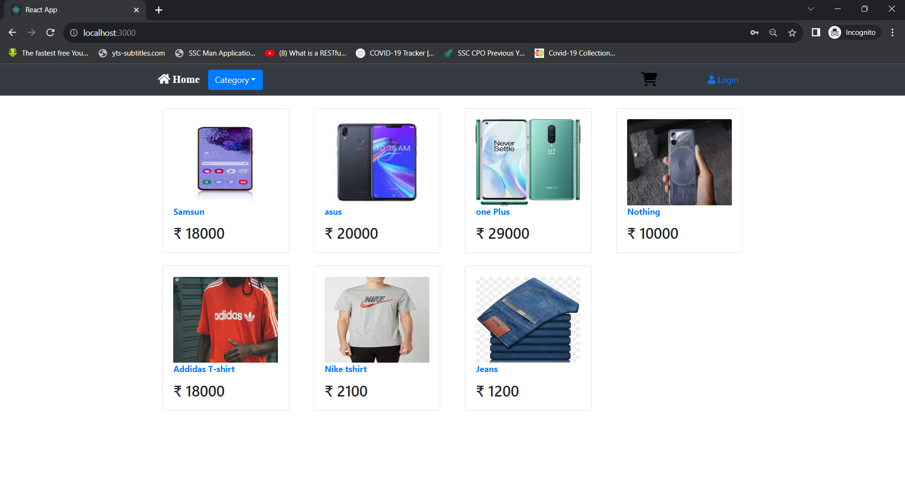

# eCommerce Backend
This project is a imitation of ecommerce website
- You can Sign-up and login to website
- You can add cart project
- You can check all products 

### Commands to run after downloading project :

### Prerequisite- Python3 

#### - Create virtual Environment inside same folder as 'manage.py'
> python -m venv venv

#### - Activate Virtual Environment
> venv/Scripts/activate

#### - Install Requirements
> pip install -r requirements.txt

#### - Start Project
> python manage.py runserver

### Steps to install frontend

First install dependencies.

> npm install

Start Project

> npm start

### Website Preview

